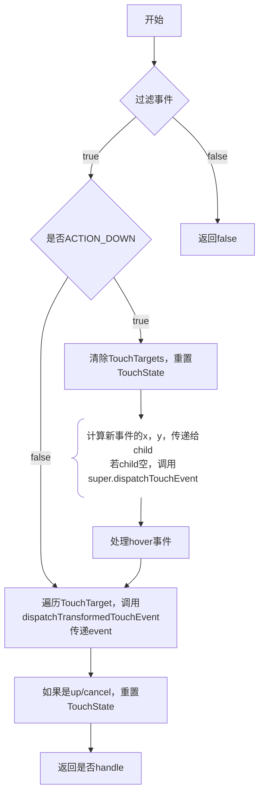

## dispatchTouchEvent



### 过滤事件

- 如果this存在flag:`FILTER_TOUCHES_WHEN_OBSCURED`，event存在flag:`FLAG_WINDOW_IS_OBSCURED`，就丢掉
- window被上面的window遮住了，不管这个时间了

```java
public void setFilterTouchesWhenObscured(boolean enabled) {
    setFlags(enabled ? FILTER_TOUCHES_WHEN_OBSCURED : 0,
            FILTER_TOUCHES_WHEN_OBSCURED);
}
```

调用view的这个函数，就会设置这个flag
- 很神奇的是，很多系统的dialog会给positiveButton设置这个flag
    - PackageInstallerActivity
    - ConfirmDialog
    - MediaProjectionPermissionActivity

```java
// todo: 没找到什么时候set: FLAG_WINDOW_IS_OBSCURED
```