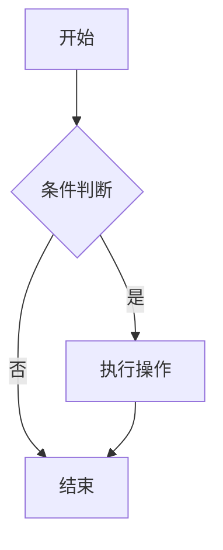

## git deplyer
[ref](https://blog.csdn.net/weixin_43659725/article/details/125207584)
## 文章目录
- icarus的文章目录只有二级标题开始才可以跳转

## 阅读更多按钮
- 安装[hexo-excerpt](https://github.com/chekun/hexo-excerpt)插件

## live2d
- 安装这个[hexo-helper-live2d](https://github.com/EYHN/hexo-helper-live2d)

## 代码块
```text

    your code here...

```

## gittalk

- 按照教程创建gittalk，填写配置文件
- [官方教程](https://ppoffice.github.io/hexo-theme-icarus/Plugins/Comment/icarus%E7%94%A8%E6%88%B7%E6%8C%87%E5%8D%97-%E7%94%A8%E6%88%B7%E8%AF%84%E8%AE%BA%E6%8F%92%E4%BB%B6/)

> 注意这里的repo是仓库名字，不是repo的url，不是repo的名称

> 通过f12的network发现发送的是apiurl+repo


comment:
    type: gitalk
    client_id: xxxxxxxxxxxxxxxxxxxx
    client_secret: xxxxxxxxxxxxxxxxxxxxxxxxxxxxxxxxxxxxxxxx
    repo: Some-of-Your-GitHub-Repo # 这里是repo的名字，不是url
    owner: you_github_name
    admin:
        - you_github_name
    per_page: 20                    # 可选填
    distraction_free_mode: false    # 可选填
    pager_direction: last           # 可选填
    create_issue_manually: false    # 可选填
    proxy:                          # 可选填
    flip_move_options:              # 可选填
    enable_hotkey: true             # 可选填
    language: zh-CN                 # 可选填


同时，在`_config.yml`下配置gitalk


gitalk:
  enable: true #默认的是false，没有打开
  owner: 'github name'
  repo: 'repo name'
  oauth:
    clientId: 'clientId'
    clientSecret: 'clientSecret'
  admin: ['githubname']


## fairyDust 鼠标特效

在`source/js`下创建文件`fairyDustCursor.js`


(function fairyDustCursor() {

    var possibleColors = ["#D61C59", "#E7D84B", "#1B8798"]
    var width = window.innerWidth;
    var height = window.innerHeight;
    var cursor = { x: width / 2, y: width / 2 };
    var particles = [];

    function init() {
        bindEvents();
        loop();
    }

    // Bind events that are needed
    function bindEvents() {
        document.addEventListener('mousemove', onMouseMove);
        document.addEventListener('touchmove', onTouchMove);
        document.addEventListener('touchstart', onTouchMove);

        window.addEventListener('resize', onWindowResize);
    }

    function onWindowResize(e) {
        width = window.innerWidth;
        height = window.innerHeight;
    }

    function onTouchMove(e) {
        if (e.touches.length > 0) {
            for (var i = 0; i < e.touches.length; i++) {
                addParticle(e.touches[i].clientX, e.touches[i].clientY, possibleColors[Math.floor(Math.random() * possibleColors.length)]);
            }
        }
    }

    function onMouseMove(e) {
        cursor.x = e.clientX;
        cursor.y = e.clientY;

        addParticle(cursor.x, cursor.y, possibleColors[Math.floor(Math.random() * possibleColors.length)]);
    }

    function addParticle(x, y, color) {
        var particle = new Particle();
        particle.init(x, y, color);
        particles.push(particle);
    }

    function updateParticles() {

        for (var i = 0; i < particles.length; i++) {
            particles[i].update();
        }

        for (var i = particles.length - 1; i >= 0; i--) {
            if (particles[i].lifeSpan < 0) {
                particles[i].die();
                particles.splice(i, 1);
            }
        }

    }

    function loop() {
        requestAnimationFrame(loop);
        updateParticles();
    }

    function Particle() {

        this.character = "*";
        this.lifeSpan = 120; //ms
        this.initialStyles = {
            "position": "fixed",
            "top": "0", //必须加
            "display": "block",
            "pointerEvents": "none",
            "z-index": "10000000",
            "fontSize": "20px",
            "will-change": "transform"
        };

        this.init = function (x, y, color) {

            this.velocity = {
                x: (Math.random() < 0.5 ? -1 : 1) * (Math.random() / 2),
                y: 1
            };

            this.position = { x: x - 10, y: y - 20 };
            this.initialStyles.color = color;
            console.log(color);

            this.element = document.createElement('span');
            this.element.innerHTML = this.character;
            applyProperties(this.element, this.initialStyles);
            this.update();

            document.body.appendChild(this.element);
        };

        this.update = function () {
            this.position.x += this.velocity.x;
            this.position.y += this.velocity.y;
            this.lifeSpan--;

            this.element.style.transform = "translate3d(" + this.position.x + "px," + this.position.y + "px,0) scale(" + (this.lifeSpan / 120) + ")";
        }

        this.die = function () {
            this.element.parentNode.removeChild(this.element);
        }

    }

    function applyProperties(target, properties) {
        for (var key in properties) {
            target.style[key] = properties[key];
        }
    }

    init();
})();


修改`node_modules/hexo-theme-icarus/layout`下的`layout.jsx`，在body中引用这个js文件


<script type="text/javascript" src="/home/js/fairyDustCursor.js"></script>


## 点击特效

编写产生点击特效的js文件


var colors = new Array("#FF0000","#FF7F00"," #FFFF00","#00FF00","#00FFFF","#0000FF","#8B00FF","#FF0000","#FF7F00"," #FFFF00","#00FF00","#00FFFF","#0000FF","#8B00FF");
var fnTextPopup = function (arr, options) {
    // arr参数是必须的
    if (!arr || !arr.length) {
        return;
    }
    // 主逻辑
    var index = 0;
    document.documentElement.addEventListener('click', function (event) {
        var x = event.pageX, y = event.pageY;
        var eleText = document.createElement('span');
        eleText.className = 'text-popup';
        this.appendChild(eleText);
        if (arr[index]) {
            eleText.innerHTML = arr[index];
        } else {
            index = 0;
            eleText.innerHTML = arr[0];
        }
        // 动画结束后删除自己
        eleText.addEventListener('animationend', function () {
            eleText.parentNode.removeChild(eleText);
        });
        // 位置
        eleText.style.left = (x - eleText.clientWidth / 2) + 'px';
        eleText.style.top = (y - eleText.clientHeight) + 'px';
        //设置颜色
        eleText.style.color = colors[index%14]
        // index递增
        index++;
    });
};

fnTextPopup(['富强', '民主', '文明', '和谐', '自由', '平等', '公正', '法治', '爱国', '敬业', '诚信', '友善']);


编写css文件

.text-popup {
    animation: textPopup 1s;
    user-select: none;
    white-space: nowrap;
    position: absolute;
    z-index: 99;
}
@keyframes textPopup {
    0%, 100% {
        opacity: 0;
    }
    5% {
        opacity: 1;
    }
    100% {
        transform: translateY(-50px);    
    }
}


在layout.jsx中引用


<link rel="stylesheet" type="text/css" href="/home/css/textPopup.css" />
<script type="text/javascript" src="/home/js/textPopup.js"></script>


## RSS生成插件，增加RSS订阅按钮

- 安装一个插件，用来生成atom.xml文件

```sh
npm install --save hexo-generator-feed
```

- 配置插件
    - head下增加rss配置

head:
    rss: /atom.xml

    - 增加对插件的配置

# Extensions
plugins:
    hexo-generator-feed
#Feed Atom
feed:
    type: atom
    path: atom.xml
    limit: 20
rss: /atom.xml

    - 配置RSS按钮

social_links:
    RSS:
        icon: fa fa-rss
        url: /atom.xml


### 优化RSS按钮
上面配置点击rss按钮，如果浏览器没有安装rss相关插件，会直接显示atom.xml的原始样式，不美观，利用js实现点击rss按钮将订阅链接复制到剪切板


function copyToClipboard(text, callBack) {
    navigator.clipboard.writeText(text).then(
        value => {
            // fulfillment
            callBack()
        }, reason => {
            // rejection
            alert("fail: " + reason)
        }
    )
}

$(document).ready(function() {
    var buttons = document.getElementsByClassName("button")
    for (let i = 0; i < buttons.length; i++) {
        if (buttons[i].getAttribute("title") == "RSS") {
            var url = document.baseURI + "atom.xml"
            buttons[i].href = "javascript:;"
            buttons[i].target = "_self"
            buttons[i].setAttribute('onclick', "copyToClipboard(\"" + url + "\", function() { alert(\"copied to clipboard\") })")
            break
        }
    }
})



### 修复插件的问题

- 插件生成的xml文件中，博客的baseUrl不对，应该是`jingtianer.github.io` 它生成的是`github.com/jingtianer`
- 生成后使用脚本替换

> 其实是配置文件里写错了


sed -i 's/github.com\/jingtianer/jingtianer.github.io/g' public/atom.xml


## 代码块复制按钮优化

- icarus的代码块复制按钮点击后只会选中代码，希望点击后能自动复制到剪切板


function copyToClipboard(text, callBack) {
    navigator.clipboard.writeText(text).then(
        value => {
            // fulfillment
            callBack()
        }, reason => {
            // rejection
            alert("fail: " + reason)
        }
    )
}

$(document).ready(function() {
    $(".copy").click(function() {
        copyCode(this)
    })
})

function copyCode(element) {
    if (element instanceof Element) {
        var elemt = element
        while(elemt.tagName != "FIGURE") {
            elemt = elemt.parentElement
        }
        elemt = elemt.getElementsByClassName("code")[0]
        
        var text =elemt.innerText
        
        copyToClipboard(text, function() {
            var node = $(element.childNodes[0])
            node.attr('class', "fa fa-check")
            setTimeout(function () { 
                node.attr('class', "fas fa-copy")
             } ,1000)
        })
    } 
}


## hexo-pdf
- [地址](https://github.com/superalsrk/hexo-pdf)

### usage

```

```

## mermaid.js支持

### 安装`hexo-filter-mermaid-diagrams`

```shell
npm install hexo-filter-mermaid-diagrams
```

### 编写`mermaidInitializer.js`，并添加到`layout.jsx`中



import mermaid from 'https://cdn.jsdelivr.net/npm/mermaid@11.6.0/+esm'
function initMermaid() {
    mermaid.initialize({ startOnLoad: true })
}
initMermaid()



<script type="module" src="/home/js/mermaidInitializer.js"></script>


### 测试一下


